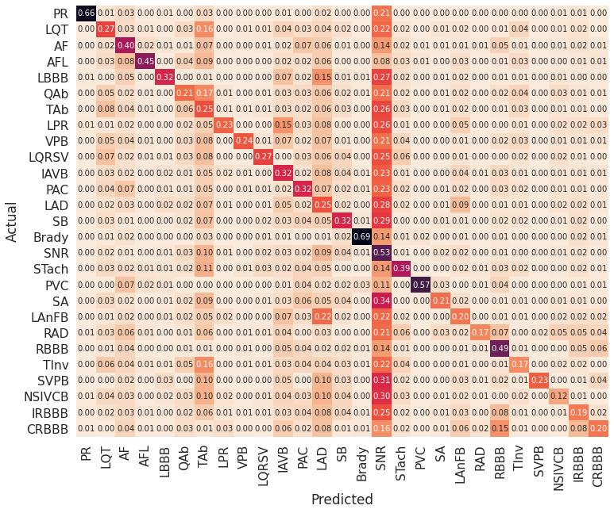
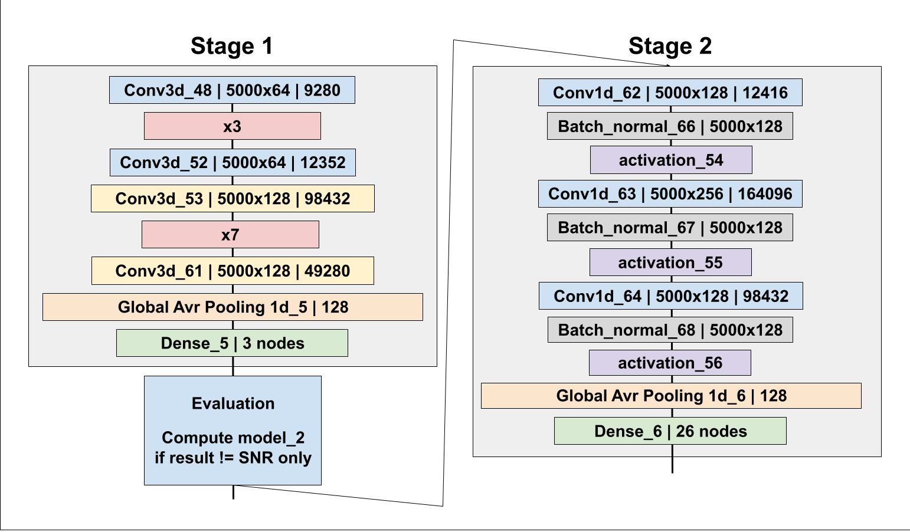

# **Arrythmia ML (ArrML) - ScienceMontgomery**

## **Details**

This project was developed as an entry into Science Montgomery CS Division. It was developed by two students at 
Poolesville High School in the SMCS house. 

## **Background**

Electrocardiograms (ECGs) provide non-invasive information about the electrical activity of the heart, allowing the ability to diagnose various arrhythmias.  Such diagnoses are currently manually interpreted, which is time-consuming, and requires skilled personnel.  Over the past decade, there has been a lot of research aiming to automatically detect and classify arrhythmias,[1] but had some degree of difficulty in classifying sinus rhythm (normal human heart rhythm) which produced false negatives.[2]

## **Engineering Goal**

Create a machine learning model that will have higher than 90% accuracy while keeping the false negative and false positive rate to 7.5% or lower when identifying arrhythmias.

## **Expected Outcome**

We believe that our goal will be met only for a subset of the types of arrhythmias and if we increase the amount of identification classes, we will see a sharp decrease in accuracy, precision, and recall which will fall below the goal.

## **Methodology**

The project used a stacked ensemble-based learning method. This method stacked two models

 - ## Model 1
   - Model 1 created distinction between **SNR (Sinus Rhythm)** and **Non-SNR (Non-Sinus Rhythm)** arrythmias
   - This reasoning is due to an anaylsis of previous projects from researchers at the University of Oslo. Confusion matricies generated from previous models showed underperformance in the classification of SNR arrythmias compared to other arrhythmias.
   

 - ## Model 2
   - Model 2 determines if the arrhythmia is one of the other 26 categories being classified.
   - This stage takes care of the rest of the classification which is an easier task for a model

 - ## Model diagram
    

## **Results**

 - ## Simplified Confusion Matrix
    | Syntax   | Pred Pos   | Pred Neg   |
    | :------- | --------   | --------   |
    | True Pos | ***46.8%***| 3.98%      |
    | True Neg | 1.53%      | ***45.3%***|

 - ## Stage 1 Statistics
    - **Accuracy** - 88.98%
    - **Loss** - 0.08
 - ## Stage 2 Statistics
    - **Accuracy** - 96.30%
    - **AUC** - 0.88
 - ## Ensemble-Model Statistics
    - **Accuracy** - 97.57%
    - **Avr. Seconds per Sample** - 2.34 seconds per sample

## **Conclusion**

Overall, our ArrML model performed higher than what was hypothesized, classifying 27 different heart conditions, with an accuracy of 97.75%.  By using a novel approach of using a two-stage model to predict arrhythmias, we achieved a better classification of sinus rhythm than models in other literature.[2][3] Future work can further improve this accuracy and achieve a stronger confusion matrix.  We believe that this model has potential to assist cardiology specialists in classifying arrhythmias, and provide a quicker and effective way of early detection of such diseases, improving the quality of life for millions of people who have arrhythmias by serving as an initial step for diagnosis.

## **Citation**

[1] Perez Alday EA, Gu A, Shah AJ, Robichaux C, Wong AI, Liu C, Liu F, Rad AB, Elola A, Seyedi S, Li Q, Sharma A, Clifford GD, Reyna MA. Classification of 12-lead ECGs: the PhysioNet/Computing in Cardiology Challenge 2020. Physiol Meas. 2020 Nov 11. http://doi.org/10.1088/1361-6579/abc960.

[2] B. -J. Singstad and C. Tronstad, "Convolutional Neural Network and Rule-Based Algorithms for Classifying 12-lead ECGs," 2020 Computing in Cardiology, 2020, pp. 1-4, doi: 10.22489/CinC.2020.227. https://ieeexplore.ieee.org/document/9344421 

[3] Singh N., Singh P. (2019) Cardiac Arrhythmia Classification Using Machine Learning Techniques. In: Ray K., Sharan S., Rawat S., Jain S., Srivastava S., Bandyopadhyay A. (eds) Engineering Vibration, Communication and Information Processing. Lecture Notes in Electrical Engineering, vol 478. Springer, Singapore. https://doi.org/10.1007/978-981-13-1642-5_42 

[4] Batra, A., & Jawa, V. (2016). Classification of Arrhythmia Using Conjunction of Machine Learning Algorithms and ECG Diagnostic Criteria. IJBB. http://www.iaras.org/iaras/filedownloads/ijbb/2016/021-0001.pdf
